# Power

## Current Design 
**Two independent groups of 3 cells in series.**  
**Nominal voltage: 12.3V**   
**Nominal current: 4000 mAh**  

### The 25R 18650 Li-ion Battery
- Discharge rate: 2000 mA
- Range of voltage: 3.6V (EoD) - 4.1V (EoC)
- Current rating: 2500mAh
- Max voltage (switch from CV to CC):  4.1V
- Icc (charging current) = .25 A 
- Max cycle life: 100 cycles  
- Normal capacity: 80% (assumed) 
- Temperature range: -20 - 50 C

## System Diagram 
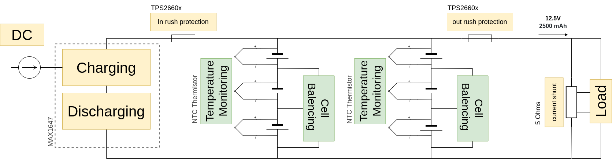

## Power Distribution
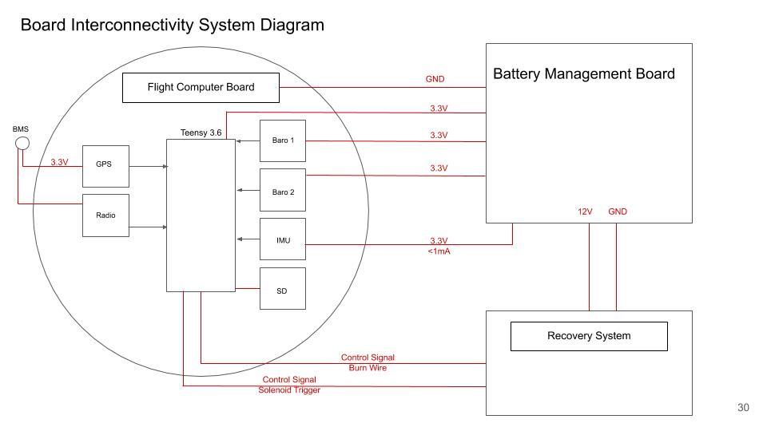

## Rev1 Schematic *1/2021
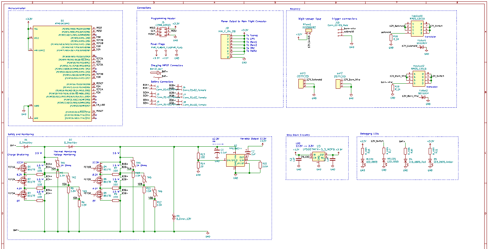

## Rev1 PCB Layout and 3D Model *1/2021
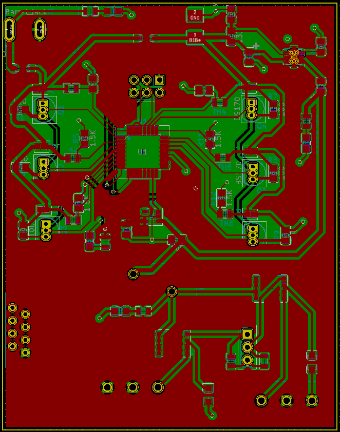 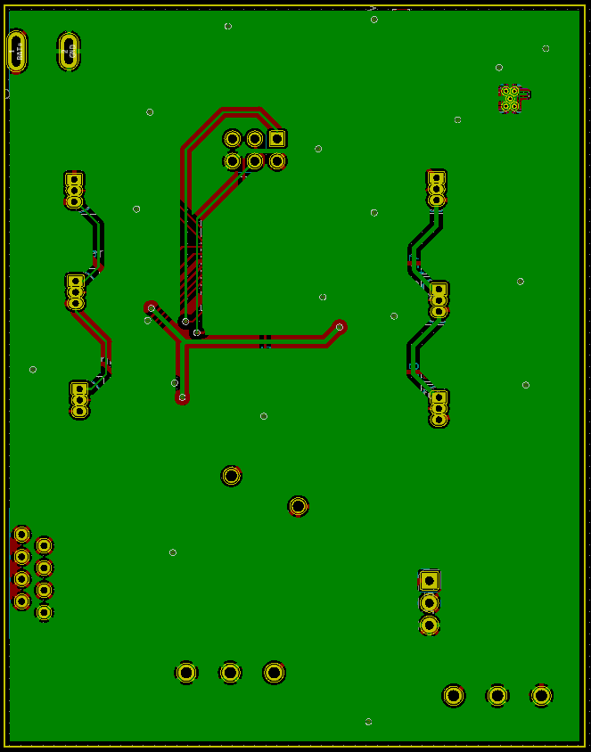
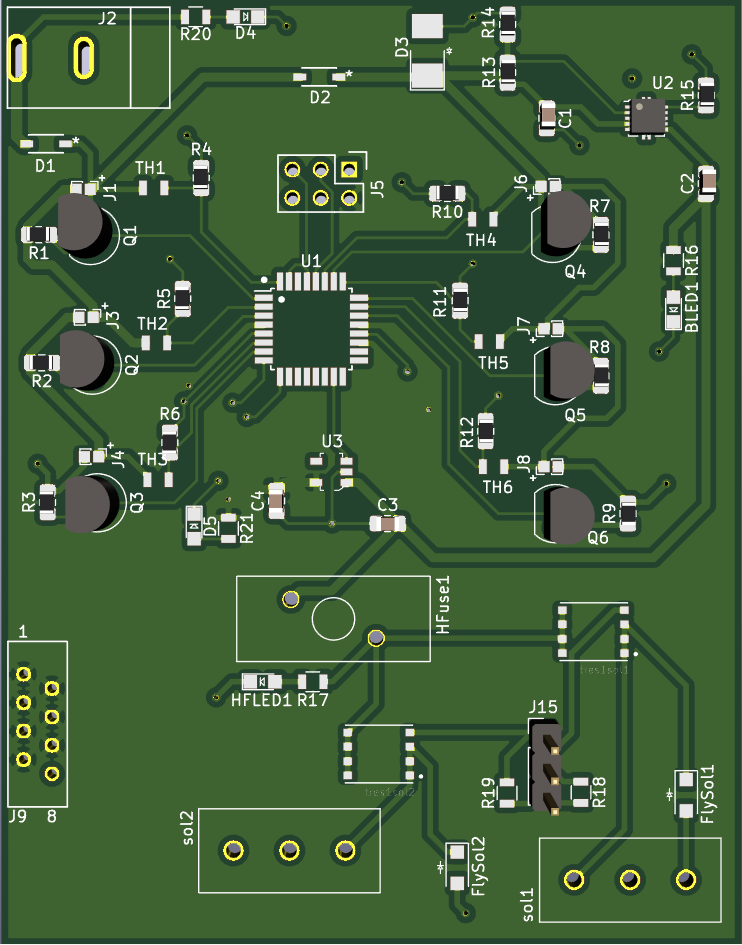

### Subsystem loads 
| Subsystem | Voltage | Current |
|-----------|---------|---------|
| Solenoid  |  12.3V  |  880mA  |
|    GPS    |  3.3V   |  30mA   |  
|   Radio   |  3.3V   |  50mA *at 13dBm* |
| Flight Computer | 3.3V | |
| BMS | 5V | |

(Live Power Budget Sheet)[https://docs.google.com/spreadsheets/d/1nH3F-o1HZTds1WetEKFTd1lCUxuCh-wOJmA-jhke28s/edit?usp=sharing]

## Firmware 
### MVP
- Read temperature from thermistors 
- Read voltage level of each battery 
- Calculate current flowing out of each battery 

### Goal 
- Trigger safety break of line when temperature rating or voltage level is above threshold 
- Balance cells using voltage readings 
- Display voltage levels 
- Send data via MQTT (or save data to SD)

## Requirements 
[General Rules and Reqs 2019](http://www.soundingrocket.org/uploads/9/0/6/4/9064598/sa_cup_irec_rules___requirements_document_20191118__rev_d_final_.pdf)
[Design, Test, Eval Guide 2019](http://www.soundingrocket.org/uploads/9/0/6/4/9064598/sa_cup_irec-design_test___evaluation_guide_20191118__rev_c_final_.pdf)
 
| Req. ID   | Requirement | Implementation | Type |
|-----------|-------------|----------------|------|
|BAT_REQ_04 | Battery Life | The batteries shall provide at least 2500 mAh of charge to the non-COTS computer power flow | Team |
|BAT_REQ_05 | Battery Quantity | The battery management board shall manage two separate batteries | Team |
|BAT_REQ_06	| Battery Draw | The battery management board shall be able to supply an expected maximum of 2000 mA | Team |
|BAT_REQ_07	| Maximum Power | Draw	The battery management board shall not draw more than 250 mA during the mission| Team|
|BAT_REQ_08	| Overall Power | Draw	The battery management board shall not draw more than 100 mAh over the course of the mission |Team|

## Design Reviews 

[Design Review 1](https://docs.google.com/presentation/d/1L4w887s7x08WpU703jKznQMGognrjYOtB8_F7KaSsSU/edit?usp=sharing): Initial design validation for cell balancing, charging, and discharging *12/2019

[Design Review 2](https://docs.google.com/presentation/d/1s-o9i7a22b9S89c6PrSgXXXy9AWuLc9d6yVl3I3lAEo/edit#slide=id.gacddbe3730_0_0): Process design review touching on integration of ATMEGA, safety switches, and voltage distribution/regulation *12/2020

## Ordering PCBs From JLCPCB

For ordering the boards, go to JLCPCB.com, and click on "Quote Now" button.

JLCPCB (ShenzhenJLC Electronics Co., Ltd.), is the largest PCB prototype enterprise in China, and a high-tech manufacturer specializing in quick PCB prototype and small-batch PCB production. You can order a minimum of 5 PCBs for just $2.

First: Upload the gerber files for the board by clicking the "Add gerber file" button. You’ll notice a message at the bottom if the file is successfully uploaded.

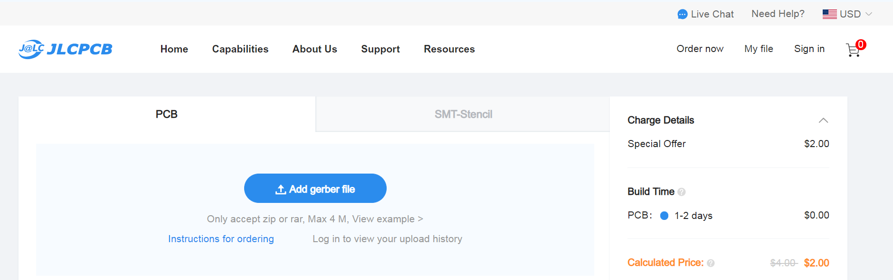

A correctly uploaded gerber folder renders the board as follows:

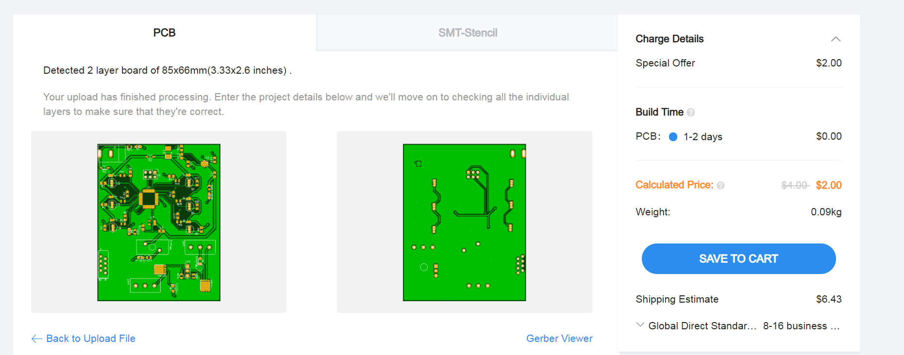

Second: In order to get the board assembled (optional, based on the project requirements), select the "SMT Assembly option. It is important to select the side of the PCB that needs to be assembled, as well as the quantity for SMT. Press the "Confirm" button, then press the "Next" button.

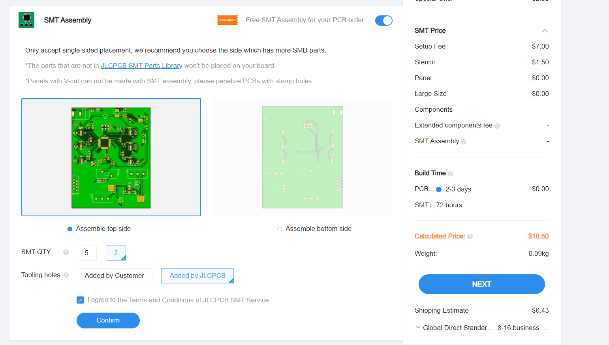

Third: upload the BOM (Bill of Material) and CPL (Component Placement List) files and click the "Next" button. It is necessary to make sure that each of these files follow the jlcpcb specified BOM and CPL formats, respectively:
* [Sample BOM](https://jlcpcb.com//video/JLCSMT_Sample_BOM1.xlsx?_ga=2.42560357.1905056644.1612161700-100444678.1610257845)
* [Sample CPL](https://jlcpcb.com//video/JLCSMT_Sample_CPL1.xlsx?_ga=2.42560357.1905056644.1612161700-100444678.1610257845)
* [SMT FAQ's](https://support.jlcpcb.com/category/78-smt-assembly?_ga=2.42560357.1905056644.1612161700-100444678.1610257845)

Note: If there is an issue with the BOM/CPL formatting, the the page will keep erroring out until it is resolved.

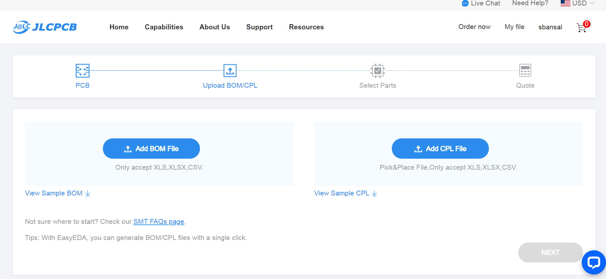

Fourth: The parts are automatically detected through the uploaded BOM. They are also matched against jlcpcb's in-stock parts. It is important to go through each row and confirm if the auto-detected parts are the desired parts. Some parts will remain undetected if they cannot be assembled through SMT and require manual assembly post-deilvery.

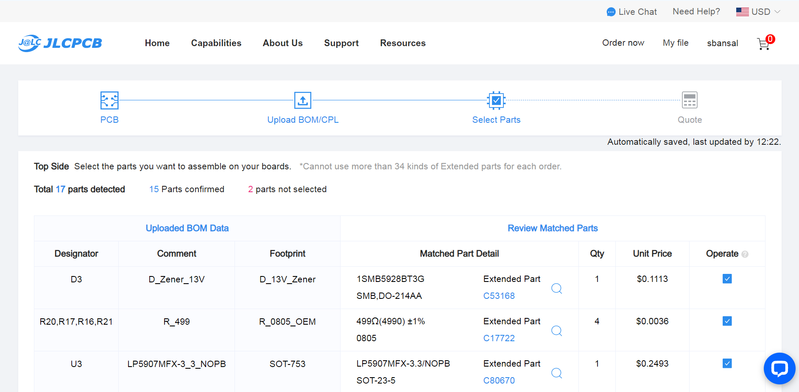

Fifth: The website renders an assembled board using the CPL file. This feature can be used to review the placement of the components (including orientation). Once carefull reviewed, the next step is to download a list of parts remaining to be assembled towards the bottom of this page view. It is important to place an order for the remaining components to be manually assembled upon delivery. 

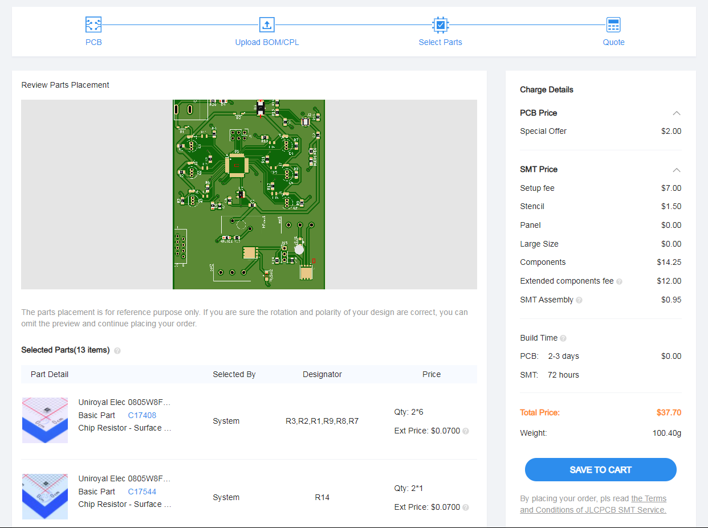

Sixth: Click on the “Save to Cart” button. Then, click on the "Secure Checkout" button. 

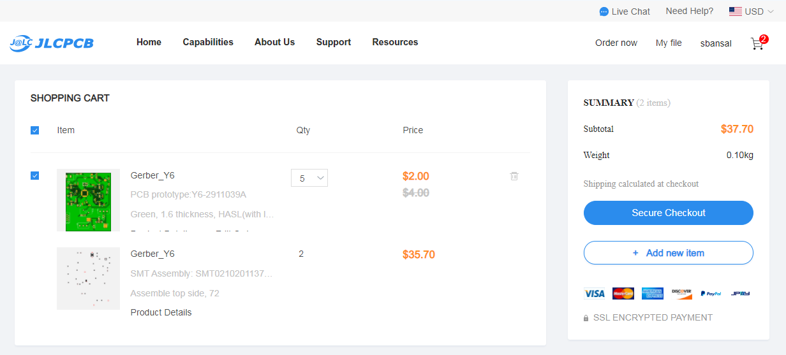

Last: Add the payment details and choose the suitable delivery method (this includes FedEx, DHL, and standard mail options). Then, place the order.

Optional: To review the production status of the board, click on the "Order History" button under username. Then, click on In Production > view progress to obtain timestamps for each of the production steps in real time. 

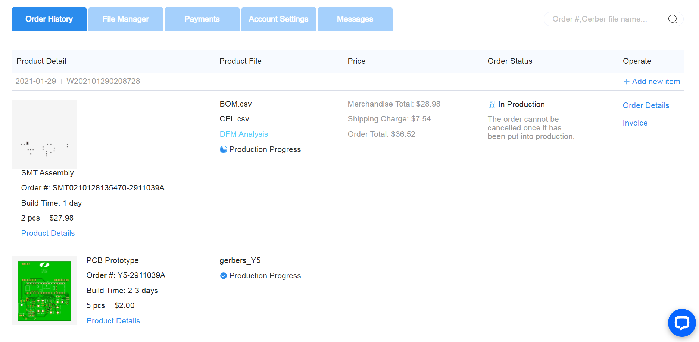

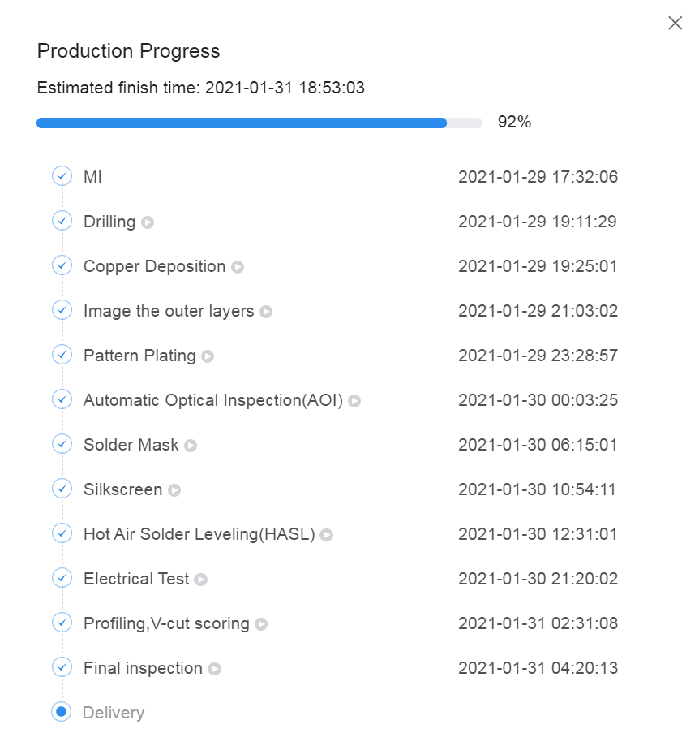

## Questions and Considerations 
